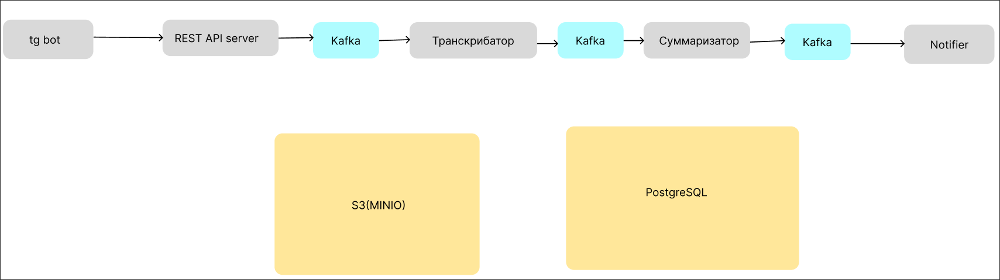

# Audio Summarizer

[](https://www.docker.com/)
[](https://www.postgresql.org/)
[](https://kafka.apache.org/)
[](https://www.min.io/)
[](#)
[](https://fastapi.tiangolo.com/)

Группа микросервисов для транскрибации и последующей суммаризации аудио, которое отправляется через Telegram-бота.

Создано на Python, FastAPI, Kafka, PostgreSQL и MinIO.

## Обзор архитектуры

Система состоит из нескольких независимых микросервисов, взаимодействующих через очереди сообщений Apache Kafka, использующих PostgreSQL в качестве основной базы данных и S3-совместимое хранилище для управления файлами.



### Технологический стек

#### Бэкенд-сервисы
- **Языки**: Python 3.12-3.13
- **Фреймворки**: FastAPI (REST API), aiogram (Telegram Bot), SQLAlchemy (ORM)
- **Очередь сообщений**: Apache Kafka 4.1.1 с режимом KRaft (без Zookeeper)
- **База данных**: PostgreSQL 18.1
- **Объектное хранилище**: MinIO (S3-совместимое)
- **AI/ML модели**:
  - Распознавание речи: Whisper Medium через faster-whisper
  - Текстовая суммаризация: DeepSeek V3.2 через OpenRouter API

#### Разработка и развертывание
- **Контейнеризация**: Docker
- **Оркестрация**: Docker Compose
- **Управление пакетами**: Poetry


### Описание микросервисов

#### 1. Сервис Telegram-бота (`telegram_file_service`)
- **Назначение**: Предоставляет пользовательский интерфейс через Telegram, принимает аудиофайлы
- **Технологии**: Python 3.12, aiogram, FastAPI, aiokafka
- **Функциональность**:
  - Аутентификация пользователей и обработка команд (`/start`, `/upload_audio`, `/cancel`)
  - Валидация и предварительная обработка аудиофайлов
  - Отслеживание прогресса с визуальными индикаторами
  - Передача аудиофайлов в REST API для обработки
  - Поддержка нескольких аудиоформатов (MP3, WAV, M4A, AAC, OGG, Opus)

#### 2. REST API сервер (`rest-api-server`)
- **Назначение**: Основная точка входа для обработки HTTP-запросов
- **Технологии**: Python 3.13, FastAPI, SQLAlchemy, aiokafka, minio
- **Функциональность**:
  - Прием аудиофайлов через HTTP multipart form data
  - Запись аудиофайлов в S3-хранилище
  - Создание записей в базе данных для отслеживания статуса обработки
  - Публикация запросов на обработку в Kafka (топик `audio_files`)

#### 3. Сервис транскрибации (`transcriber`)
- **Назначение**: Преобразует аудио в текст с использованием моделей распознавания речи
- **Технологии**: Python 3.13, faster-whisper, aiokafka, SQLAlchemy, psycopg, minio
- **Модель**: Предварительно загруженная модель Whisper Medium
- **Функциональность**:
  - Получает имя аудиофайла из Kafka (топик `audio_files`)
  - Загружает аудиофайлы из S3-хранилища
  - Транскрибирует аудио
  - Сохраняет транскрипции в S3
  - Обновляет статус в базе данных
  - Публикует uuid (имя файла транскрипции) в Kafka (топик `transcriptions`)

#### 4. Сервис суммаризации (`summirizer`)
- **Назначение**: Генерирует текстовые сводки из транскрипций с использованием LLM
- **Технологии**: Python 3.13, OpenAI SDK (OpenRouter), aiokafka, SQLAlchemy, minio
- **Функциональность**:
  - Получает именя файла транскрипции из Kafka (топик `transcriptions`)
  - Загружает текст транскрипций из S3
  - Генерирует краткое содержание текста через модели из OpenRouter API
  - Сохраняет суммаризированный текст в S3
  - Публикует в Kafka (топик `summaries`)

#### 5. Сервис уведомлений (`notify`)
- **Назначение**: Уведомляет пользователей о завершении процесса суммаризации файла
- **Технологии**: Python 3.13, aiokafka, minio
- **Функциональность**:
  - Получение имя файла сводки из Kafka (топик `summaries`)
  - Загружает суммаризированный текст из S3
  - Вывод информации пользователю в чат

#### 6. Инфраструктурные сервисы
- **База данных PostgreSQL**: Центральное хранилище данных для учетных записей пользователей, аудиофайлов, транскрипций и сводок
- **MinIO (S3)**: Объектное хранилище для аудиофайлов, транскрипций и сводок
- **Кластер Apache Kafka**: кластер из 1 основого сервера и 2 реплик для надежной очереди сообщений между сервисами

### Схема базы данных

Система использует PostgreSQL со следующими основными таблицами:

- `multiplatform_accounts` - Учетные записи пользователей на разных платформах
- `singleplatform_accounts` - Платформо-специфичные идентификаторы пользователей (Telegram и др.)
- `audio_files` - Метаданные аудиофайлов и статус обработки
- `transcriptions` - Записи транскрипций и их статус
- `summaries` - Записи сводок и их статус


### Начало работы

#### Предварительные требования
- API key от OpenRouter
- API key от Telegram-бота

#### Запуск
```
git clone https://github.com/isOdin-l/AudioSummarizer && cd AudioSummarizer
```

Настройте все переменные окружения :)

Запустите все сервисы
docker-compose up -d

Доступ к сервисам:
- REST API: http://localhost:8000
- Консоль MinIO: http://localhost:9001
- Telegram Bot: Подключитесь через @YourBotName

#### Переменные окружения
Ключевые переменные окружения:
- `API_KEY`: Ключ API OpenRouter для суммаризации
- `TELEGRAM_BOT_TOKEN`: Токен Telegram-бота
- Учетные данные базы данных (PostgreSQL)
- Учетные данные S3/MinIO
- Конфигурация Kafka


#### REST API сервер (`http://localhost:8000`)
- `POST /api/v0/audio_summarise` - Отправить аудиофайл для обработки
- Параметры: `source_type`, `interaction_data`, `file` (multipart/form-data)


### Структура проекта
- **migrations/** Миграции базы данных
- **rest-api-server/** REST API сервис
- **transcriber/** Сервис транскрибации
- **summirizer/** Сервис суммаризации
- **telegram_file_service/** Сервис Telegram-бота
- **notify/** Сервис уведомлений